# Project_Graduation

This repo is the Graduation Project that is about A.I Web Site. 

A.I tech is Neural Style Transfer in CNN, Teachable Machine of the Google.

Used language : javascript, PHP   

# 1. Poster
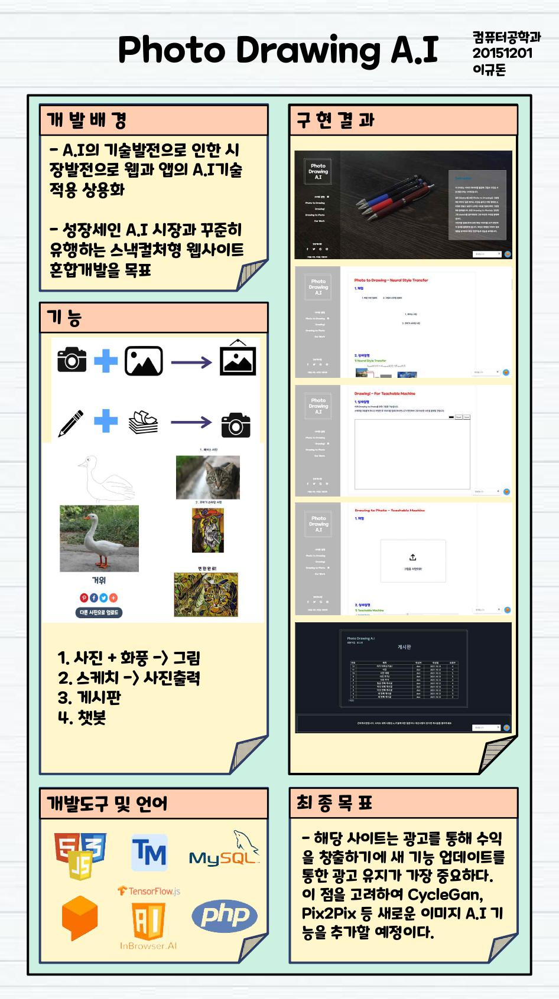

---
# 2. Main Service
## 1) Photo to Drawing : Neural Style Transfer
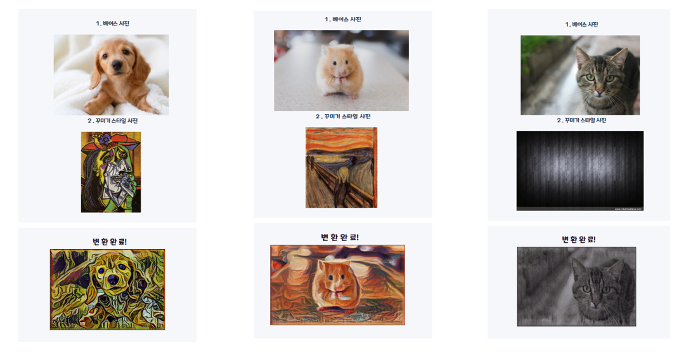
Source code : https://github.com/donhaklee/Project_NeuralStyleTransfer  
Reference : https://rn-unison.github.io/articulos/style_transfer.pdf

## 2) Drawing to Photo : Teachable Machine
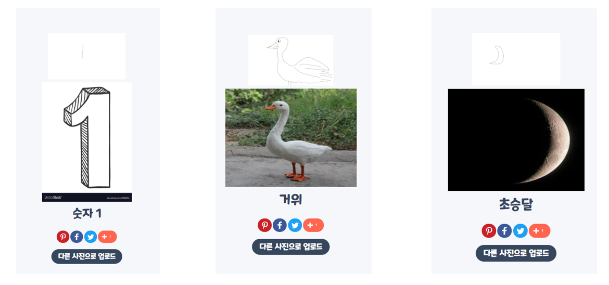
---
# 3. Client
## 1) UI
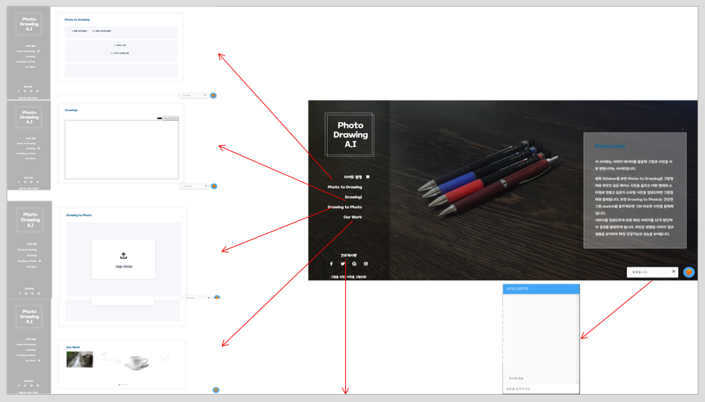
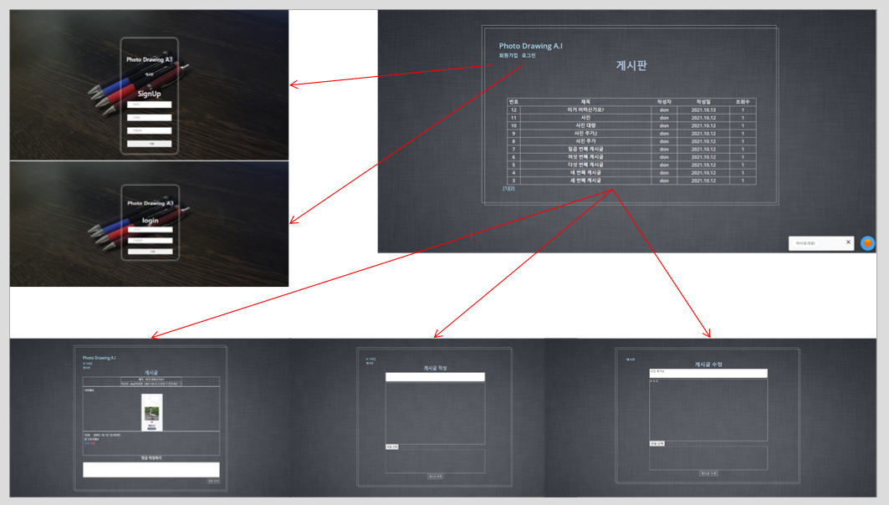

## 2) Sequence Diagram
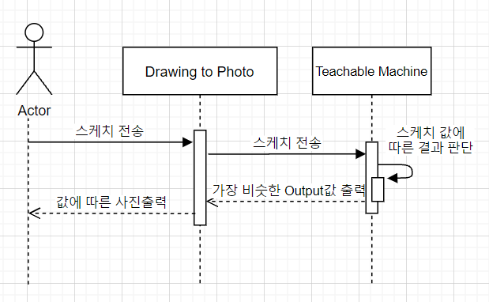
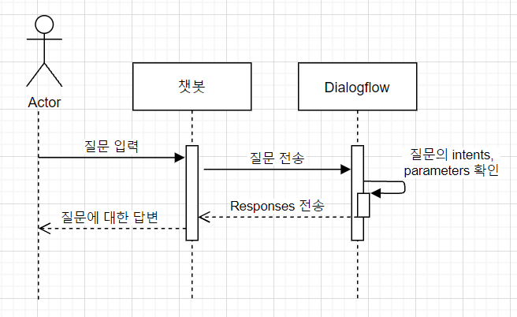
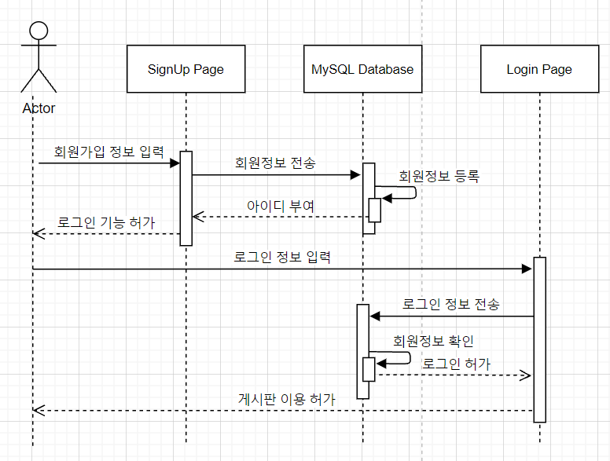

---
# 4. Server
## 1) Flowchart
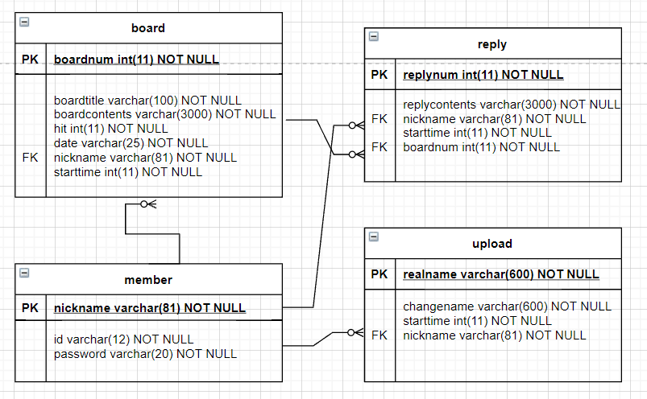

## 2) Database E-R Diagram

---
# 5. Data Training
## 1) Kaggle(ImageNet) + Crawling + Teachable Machine
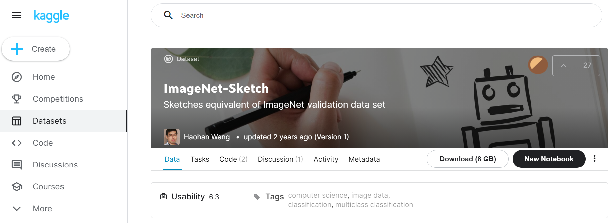
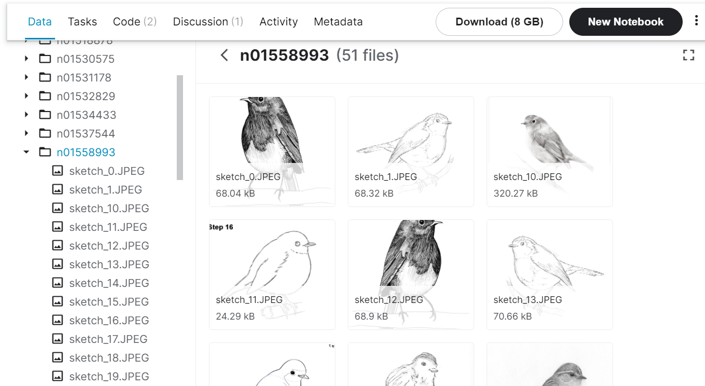
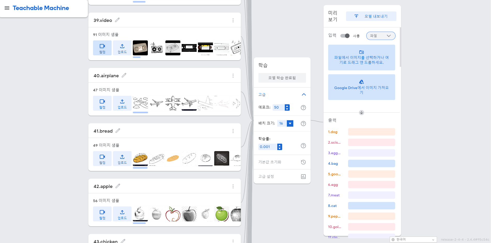

## 2) chatbot Dialogflow
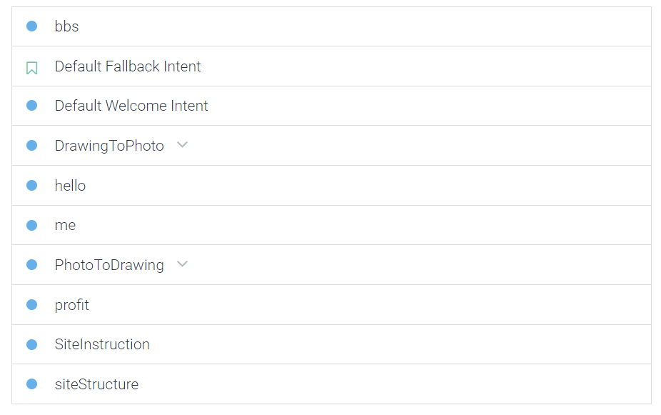
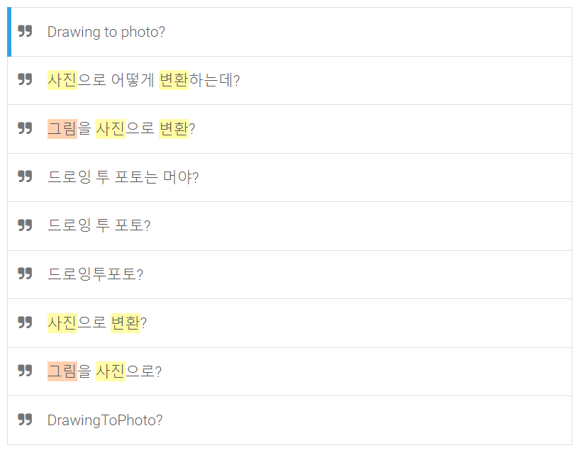
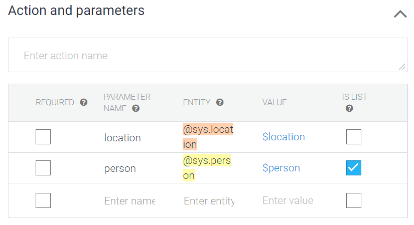
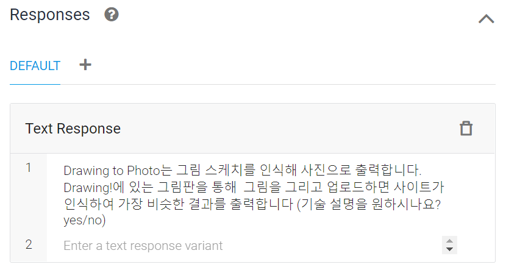
