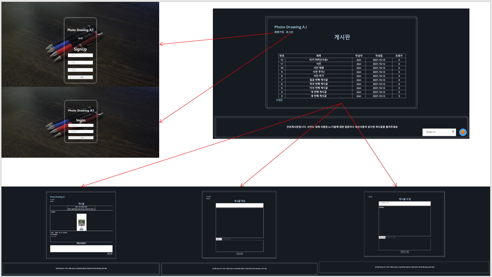

# Project_Graduation

This repo is the Graduation Project

# 판넬

---
# Client
## 1) UI

## 2) Sequence Diagram

---
# Server
## 1) Flowchart

## 2) Database E-R Diagram

---
# Data Training
## 1) Kaggle(ImageNet) + Crawling + Teachable Machine

## 2) chatbot Dialogflow

